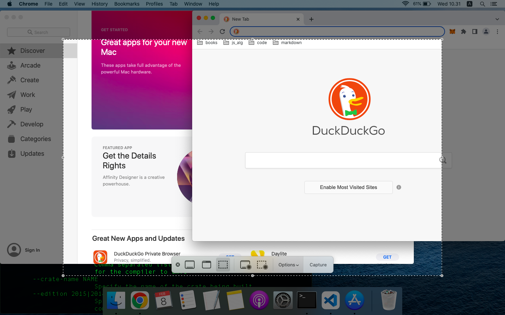
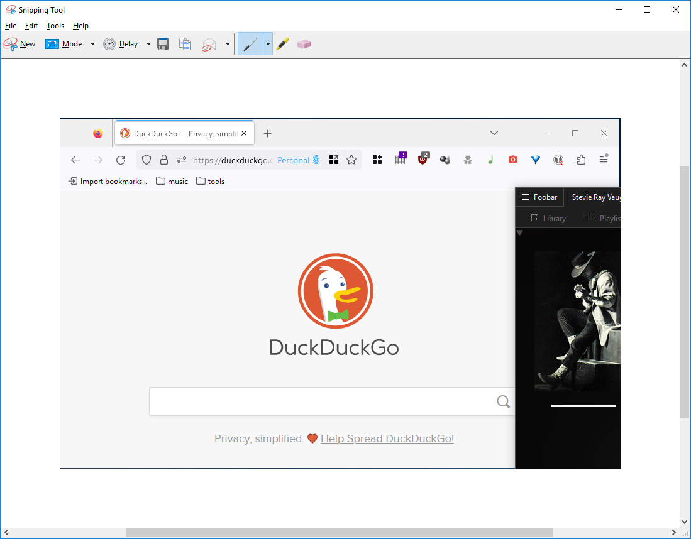

# Taking Screenshot in a Hassle-Free Way on Linux, macOs, or Windows 10

## Why do you need to care?
Knowing how to take a screenshot of your computer screen in a quickest possible way is quite an important skill to have. From creating online articles, blog or forum posts, work-related emails, error-reporting, down to performing system troubleshooting with a remote assistant, screenshots can help to elaborate your problem or situation. It can also be used as evidence to support your statement (hopefully not in a legal-ish way).

I write this short article (or guide, whatever) initially as a way to stop myself from googling "how to take a screenshot in Windows/Mac/Linux" in a hasty way and kept forgetting to write it down afterwards, all the time. I had enough with these horrendous cycles. 

I will show you two methods to take a screenshot for each Operating System (OS). First, by using the keyboard shortcuts (this is the quickest way) and second, by using a built-in program in your OS. **No time to google and install another app when you are in a hurry!** The OS used in this guide are Linux Mint 21.1 Mate Edition, macOS Catalina 10.15.3, and Windows 10. So lets get started!

 

*******
Tables of contents:  
 1. [Creating a screenshot in Linux Mint](#linuxmint)
 2. [Creating a screenshot in macOS](#macOS)
 3. [Creating a screenshot in Windows 10](#win10)

*******

 

## Creating a screenshot in Linux Mint
### By using keyboard 
These two methods will open a **Save Screenshot** window where you can rename, select save location, copy to clipboard (and paste it to another app), create a new one, or cancel the current one and exit the window. By default, the file format is png, but you can also use jpg or gif format.
* Press `PrintScreen` or `PrtSrc` button to take a full screenshot (the entire screen, including your secondary screen)

|  | 
|:---:| 
| *a full screenshot* |

* Or, by pressing `Alt + PrintScreen` buttons at once to take a screenshot of the current active app window, Firefox on this screen.

|  | 
|:---:| 
| *a screenshot of the active window* |

### By using Take Screenshot app - Steps
1. Click the start menu and search for "take screenshot" app.
2. "Take Screenshot" app will appear, press ENTER or click the icon to open it.

|  | 
|:---:| 
| *running Take Screenshot app* |

3. The app have several options and features for taking a screenshot:
    * *"Grab the whole desktop"*: This is similar to pressing `PrintScreen (PrtSrc)` button.
    * *"Grab the current window"*: This is similar to pressing `Alt + PrintScreen (PrtSrc)` buttons.
    * *"Select area to grab"*: Your cursor will change to a crosshair, select an area on your screen by clicking and holding your left mouse button, then drag it to create a selection. Release the mouse button to open a "Save Screenshot" window (same thing as in keyboard shortcuts method).
    * You can specify a delay time before the app will take a screenshot automatically.
    * You can include your mouse cursor or not by ticking the "include pointer" checkbox.

|  | 
|:---:| 
| *Take Screenshot app window* |

 

***

## Creating a screenshot in macOS
### By using keyboard - Part 1
After you take a screenshot with any of the following methods, a small display of your screenshot appears at the bottom right of your screen. Click it to annotate your screenshot, otherwise it will save the image to your desktop by default.
* Press `Shift + Command (⌘) + 3` buttons at once to take a full screenshot, including your secondary screen. The screenshot image file will be saved to your desktop by default.

|  | 
|:---:| 
| *Full screenshot in macOS* |

* Press `Shift + Command (⌘) + 4` buttons at once to take a region screenshot. Once your cursor changed to a crosshair, you can create a selection. Here I will select an area inside the Chrome window.

|  | 
|:---:| 
| *Region or selection screenshot in macOS* |

* Press `Shift + Command (⌘) + 4 + Spacebar` buttons at once to take a screenshot of the active window. You can select any app window by hovering your cursor to it, then press your left mouse button to capture, or `Esc` to cancel.

|  | 
|:---:| 
| *Active window screenshot in macOS* |

### By using keyboard - Part 2
The following methods will put the screenshot in the clipboard. This enables you to paste it into a text editor, word processor, and other apps or uses.
* Press `Command (⌘) + Ctrl + Shift + 3` buttons at once to take a screenshot of the active window.
* Press `Command (⌘) + Ctrl + Shift + 4` buttons at once to take a region screenshot. Once your cursor changed to a crosshair, you can create a selection.

### By using Screenshot app
1. Open the launchpad.

|  | 
|:---:| 
| *macOS Catalina Launchpad* |

2. At the search box on top, search "screenshot", click to run the app.

|  | 
|:---:| 
| *Search launchpad for Screenshot app* |

3. Specify how do you want to take the screenshot, and where to save it.
4. Click "capture" to take a screenshot.

|  | 
|:---:| 
| *Screenshot app* |

 

***

## Creating a screenshot in Windows 10
### By using keyboard
The following methods create two kinds of outputs. First a screenshot image file located in "Pictures\screenshot" folder (default), and second, a clipboard copy of the screenshot which you can paste to a text editor, word processor, and other apps such as paint.
* Press `PrintScreen (PrtSrc)` button to take a full screenshot, including your secondary screen. The screenshot is copied to clipboard.
* Press `Windows Key + PrintScreen (PrtSrc)` buttons to take a full screenshot. The output will be saved to "Pictures\screenshot" folder.
* Press `Alt + PrintScreen (PrtSrc)` to take a screenshot of the current active window. The screenshot is copied to clipboard.
* Press `Windows Key + Shift + S` to create a rectangular selection screenshot, use your mouse select an area of interest on your screen (similar steps with "Select area to grab" in Linux Take Screenshot app). The screenshot is copied to clipboard.

### By using Snipping Tool

|  | 
|:---:| 
| *Snipping Tool window* |

1. Click the start menu and search for "snipping tool" app.
2. "Snipping Tool" app will appear on "Best match" result, press ENTER or click the icon to open it.
3. You can select four modes to take a screenshot:
    1. Free-form Snip: This is similar to `Windows Key + Shift + S` method, but instead of rectangular, you get a "lasso-like" tool. 
    2. Rectangular Snip: This is similar to `Windows Key + Shift + S` method.
    3. Window Snip: This is similar to `Alt + PrintScreen (PrtSrc)` method, but it is more flexible. You can select any window to take its screenshot.
    4. Full-screen Snip: This is similar to `PrintScreen (PrtSrc)` method.
4. You can also add a delay time before the app will take the screenshot up to 5 seconds.
5. To create a screenshot, click the "new" button, your screen will be a bit blurred. Depending on your screenshot mode, you can proceed to create a selection, or click the mouse button.This is similar to `Windows Key + Shift + S` method.This is similar to `Windows Key + Shift + S` method.

|  | 
|:---:| 
| *a fullscreen snip will include your secondary monitor* |

6. Once you did it, a new will appear where you can specify save location (as html, png, gif, or jpeg file), email it, or annotate it. Press "new" button to create a new screenshot and cancel the current one.

|  | 
|:---:| 
| *after taking a rectangular snip screenshot, a window will appear in edit mode* |

## End note
Thank you very much for reading my article. In the end, it turns out that taking a screenshot is easy, regardless of your operating system. If you still find the above methods difficult to follow, you can try to install any specialized app to your liking that will help you to take screenshots.